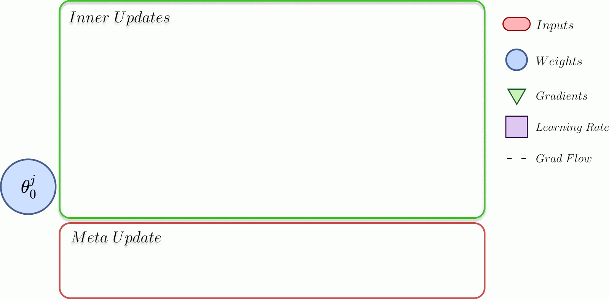

# La-MAML: Reproducibility Challenge 2020

This repository is the unofficial implementation of the NeurIPS paper **Look-Ahead Meta-Learning for Continual Learning** for the reproducibility challenge 2020.

<font size="+1">[Paper](https://arxiv.org/abs/2007.13904) | [Colab](https://colab.research.google.com/drive/1iCvM3P-fP9tZJbSCfuSga-Rt2xHvvPHt?usp=sharing) | [Runs](https://wandb.ai/glitchfilter/La-MAML) | [Official Repo](https://github.com/montrealrobotics/La-MAML)</font>

<!--  -->

## How to run on Colab
Example Notebook - [Colab](https://colab.research.google.com/drive/1iCvM3P-fP9tZJbSCfuSga-Rt2xHvvPHt?usp=sharing)

## WandB Logs
The dashboard for this project can be accessed [here](https://wandb.ai/glitchfilter/La-MAML).

## Citation

```
@article{gupta2020maml,
  title={La-MAML: Look-ahead Meta Learning for Continual Learning},
  author={Gupta, Gunshi and Yadav, Karmesh and Paull, Liam},
  journal={arXiv preprint arXiv:2007.13904},
  year={2020}
}
```
